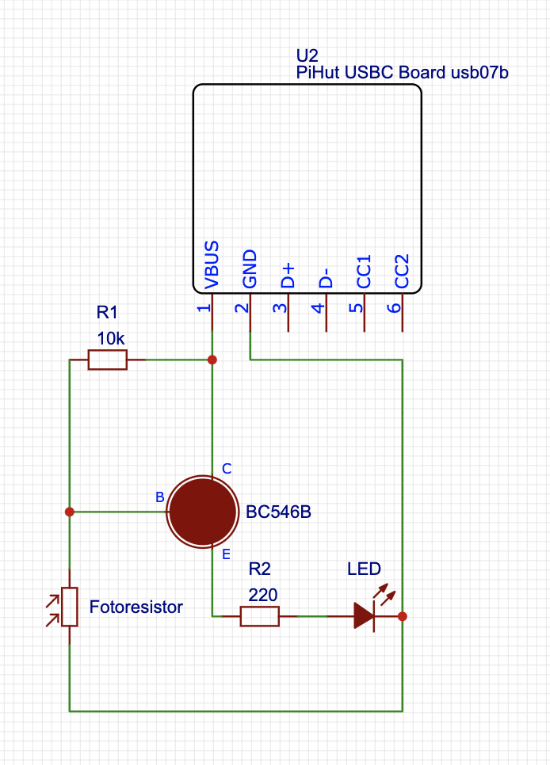
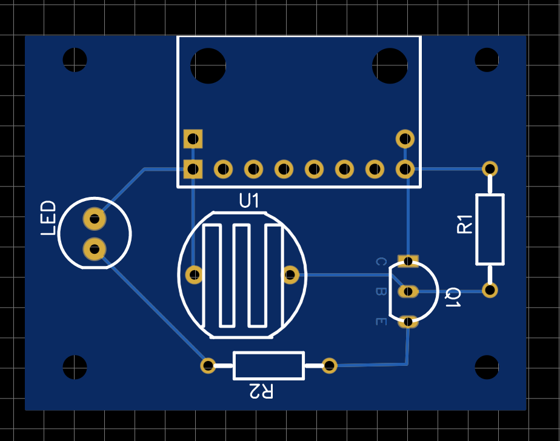
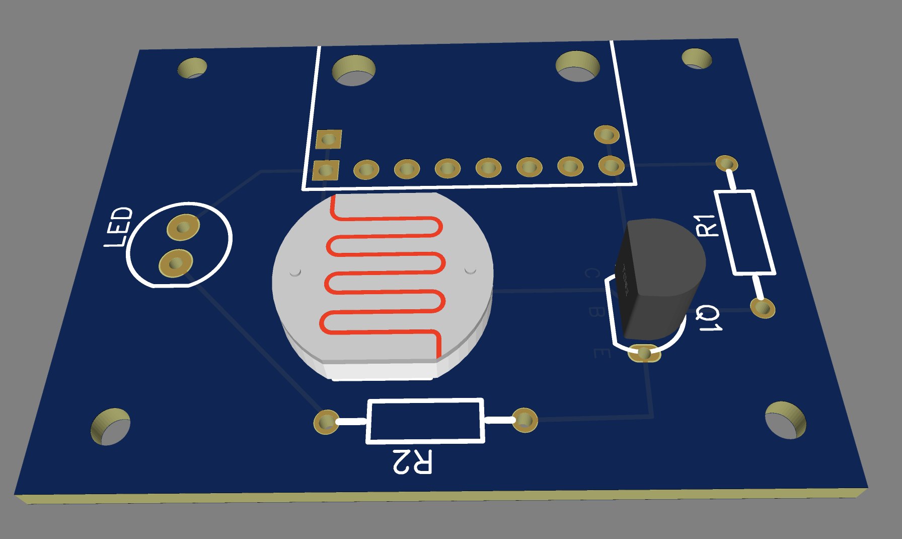

# Dark Detector — Technical Review

## Circuit topology

USB-powered dark-activated LED driver using a discrete NPN transistor as a low-side switch.

**Signal path:** LDR + R1 voltage divider → BC546B base → emitter-follower drives LED through R2.

## Schematic



## Bill of Materials

| Ref | Component        | Value / Part          | Package    |
|-----|------------------|-----------------------|------------|
| U2  | USB-C breakout   | PiHut usb07b          | THT        |
| Q1  | NPN transistor   | BC546B                | TO-92      |
| R1  | Resistor         | 10 kΩ                 | THT 0207   |
| R2  | Resistor         | 220 Ω                 | THT 0207   |
| U1  | Photoresistor    | LDR                   | THT        |
| LED | LED              | Red, 5 mm             | THT        |

## Operating conditions

| Parameter          | Value   |
|--------------------|---------|
| Supply voltage     | 5 V (USB VBUS) |
| LED forward voltage | ~2.0 V |
| V_CE(sat)          | ~0.2 V |
| LED current        | ~12.7 mA |
| Base current       | ~0.05 mA |
| Transistor β       | ~200    |

## Calculations

### LED current (dark state)

```
V_R2 = V_USB − V_LED − V_CE(sat) = 5.0 − 2.0 − 0.2 = 2.8 V
I_LED = V_R2 / R2 = 2.8 / 220 ≈ 12.7 mA
```

### Base drive

```
I_B = (V_base − V_BE) / R1 = (1.2 − 0.7) / 10k ≈ 0.05 mA
I_C = β × I_B = 200 × 0.05 = 10 mA
```

Transistor is driven into saturation — LED current is resistor-limited, not β-dependent.

## KVL / KCL verification

**KVL (LED loop):**
`V_USB − V_CE − V_LED − V_R2 = 0` → `5.0 − 0.2 − 2.0 − 2.8 = 0` ✓

**KCL (transistor node):**
`I_E = I_C + I_B` → standard BJT current relationship holds.

## PCB

Single-layer through-hole design. EasyEDA project files and Gerber archive included in repository.




## Enclosure

3D-printed case designed in OpenSCAD. Two-part design (top + bottom).

- Inner dimensions: 42 × 32 mm
- Wall thickness: 2 mm
- Features: USB-C cable cutout, LED and LDR cylindrical sleeves with pass-through holes

Source files: `dark_detector_case_bottom.scad`, `dark_detector_case_top.scad`

## Design files

| File | Description |
|------|-------------|
| `Gerber_PCB_DarkDetector.zip` | Fabrication-ready Gerber archive |
| `PCB_DarkDetector.json` | EasyEDA PCB layout |
| `PCB_DarkDetector/DarkDetector.json` | EasyEDA schematic + BOM |
| `dark_detector_case_bottom.scad/.stl` | Enclosure bottom (OpenSCAD) |
| `dark_detector_case_top.scad/.stl` | Enclosure top (OpenSCAD) |
